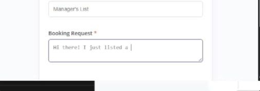
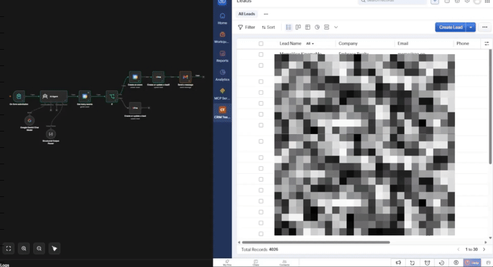
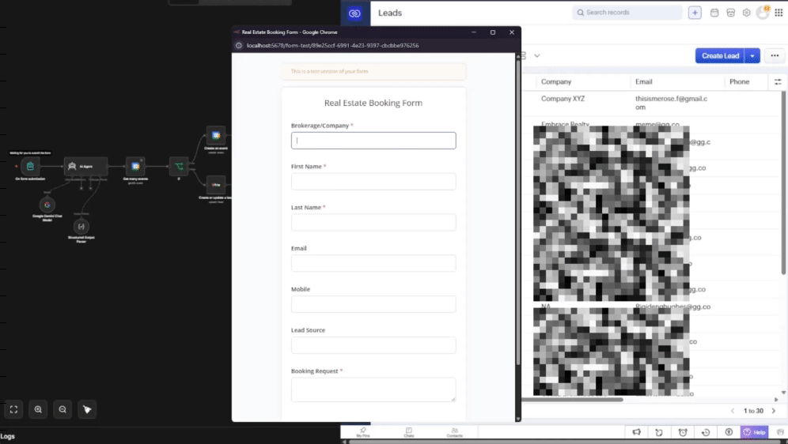

# Real Estate App Scheduler

## Features:
1. Connects to Zoho CRM
2. Connects to you Google Calendar
3. Connects to your Google Gmail
4. with AI Agent to analyze your Booking Request!

### 🔀 Data Flow
Web Form ➔ AI Webhook ➔ (Zoho CRM + Google Calendar) ➔ Gmail Confirmation

### 🧠 Smart Conflict Resolution

The AI Agent doesn't just blindly forward data; it manages scheduling conflicts to protect the agent's time. 

* **Context-Aware Parsing:** The AI understands natural language requests (e.g., "Sometime next Tuesday afternoon") and translates them into precise, available calendar blocks.
* **Data Validation:** Ensures all required contact information is present before polluting the CRM with incomplete lead records.

### For Improvements
* **Double-Booking Prevention:** If a lead requests a time slot that is already taken, the AI intercepts the request, cross-references Google Calendar for the next available adjacent slots, and automatically drafts an email proposing alternative times.
